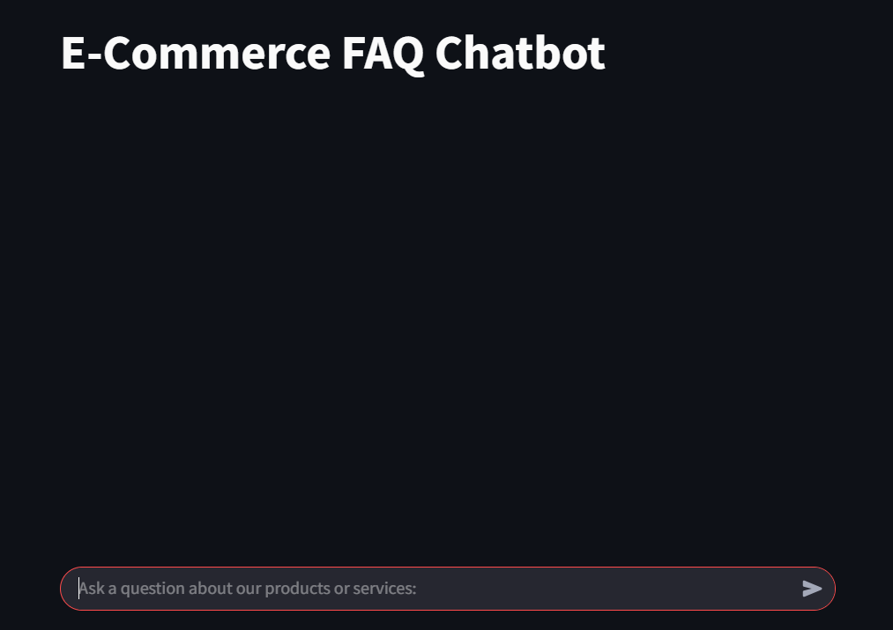
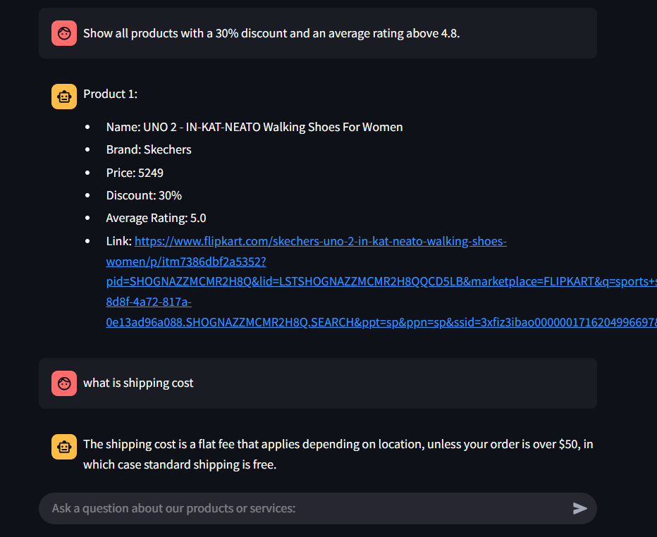
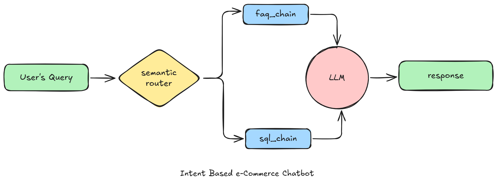

# E-Commerce chatbot

**Project Overview**
- **Purpose:** A Streamlit-based assistant that answers FAQ-style questions using a small RAG (ChromaDB) FAQ store and executes natural-language product queries by generating SQL against a local SQLite catalog.
- **POC status:** This repository is a proof-of-concept implementation meant to showcase a hybrid FAQ + SQL routing architecture, not a production-grade ecommerce system.
- **Use case:** Demonstrates retrieval-augmented generation, semantic routing (FAQ vs SQL), and safe fallbacks so the app runs even without heavy ML dependencies.

**Resume Summary (one line)**
- Built a Streamlit chat assistant that routes user queries to either a ChromaDB-backed FAQ retriever or a Groq-powered SQL generator, integrating embeddings, local DB querying, and robust error handling.

**Features**
- **FAQ RAG:** Retrieves answers from `App/resources/faq_data.csv` using ChromaDB embeddings (if available).
- **SQL generation:** Converts natural language product requests to SQLite `SELECT` queries and returns formatted product lists.
- **Safe fallbacks:** Keyword routing, CSV fuzzy-search, and local formatting when ML models or API calls fail.
- **Simple UI:** Streamlit chat interface with session history and immediate rendering of responses.

**Screenshots**
- **Chat interface / blank start**: The app opens with a clean Streamlit chat UI, accepts user queries, and preserves session history.

  

- **Routing examples / FAQ and SQL output**: The assistant distinguishes FAQ vs SQL queries and displays both knowledge-based answers and product search results.

  

**System Diagram**
- The app starts with a user question in the Streamlit chat UI.
- `App/main.py` receives the question and sends it to `App/router.py`.
- `App/router.py` classifies the query as either an FAQ request or a product search.
- FAQ queries are handled by `App/faq.py`, which retrieves relevant answers from `App/resources/faq_data.csv` and optionally uses ChromaDB embeddings.
- Product search queries are handled by `App/sql.py`, which generates SQLite SQL, runs it against `App/db.sqlite`, and formats the results.
- Responses are returned to the Streamlit UI and displayed in chat form.

  

**Architecture & File Structure**
- **`App/main.py`**: Streamlit chat application and orchestration layer that captures user input, manages session history, and routes requests to the backend pipeline. ([App/main.py](App/main.py))
- **`App/router.py`**: Adaptive intent router that chooses FAQ or SQL processing using semantic intent classification with a deterministic fallback. ([App/router.py](App/router.py))
- **`App/faq.py`**: FAQ knowledge engine that ingests structured customer questions, performs retrieval, and builds context-aware answer generation. ([App/faq.py](App/faq.py))
- **`App/sql.py`**: Product search engine converting natural language into SQLite queries, executing them locally, and formatting results for chat display. ([App/sql.py](App/sql.py))
- **`App/resources/faq_data.csv`**: Curated FAQ knowledge base for the RAG retrieval pipeline. ([App/resources/faq_data.csv](App/resources/faq_data.csv))
- **`App/db.sqlite`**: Local ecommerce catalog containing products used for SQL-powered search and discovery. ([App/db.sqlite](App/db.sqlite))
- **`.vscode/launch.json`**: Developer-friendly debug configurations for attaching VS Code to the Streamlit runtime. ([.vscode/launch.json](.vscode/launch.json))

**Quick Setup (Windows / Conda)**
1. Create / activate environment and install deps:
```powershell
conda create -n ai_env python=3.11 -y
conda activate ai_env
pip install -r requirements.txt  # or install chromadb groq streamlit transformers sentence-transformers
```
2. Ensure `.env` in `App/` contains `GROQ_API_KEY` and `GROQ_MODEL_NAME`.

**Run the app**
```powershell
conda activate ai_env
python -m streamlit run App/main.py
# open http://localhost:8501
```

**Debugging tips**
- If you see OSError related to `c10_cuda.dll`, install a CPU-only PyTorch via conda: `conda install -y -c pytorch pytorch cpuonly`.
- If Groq returns model decommission or token-limit errors, switch `GROQ_MODEL_NAME` in `App/.env` to a supported smaller model or add limits (e.g., `LIMIT 10`) in SQL prompt.

**Usage examples**
- FAQ: "What is the shipping time?" → answers from FAQ CSV.
- FAQ: "How can I track my order?" → retrieves answer from the FAQ knowledge base.
- FAQ: "Do you offer international shipping?" → returns shipping availability details.
- SQL: "Show Puma shoes under 3000" → routes to SQL, generates `SELECT`, and returns product results.
- SQL: "Find Nike products with discount" → tests brand filtering and search intent.
- SQL: "List top-rated running shoes" → validates natural-language query parsing into SQL.

**Validation questions**
Use these sample prompts to verify the core app flows:
- "What is the shipping time?"
- "How do I track my order?"
- "Can I cancel my order after placing it?"
- "Show Adidas shoes under 2500"
- "Find products with a discount greater than 30%"
- "Do you offer cash on delivery?"

**Notes & Known Limitations**
- Full semantic routing and local embeddings require `sentence-transformers` + PyTorch; when not available the code uses deterministic fallbacks so the app remains usable.
- Groq API usage is subject to model availability and TPS/TKM limits — the app handles API errors gracefully and falls back to local formatting.

If you want, I can:
- add a `requirements.txt` and a short CONTRIBUTING.md, or
- create a ready-to-push GitHub repo with a polished README and commit history.

----
Created for use as a showcase project in portfolios and resumes. Contact: add your email or GitHub handle before publishing.
